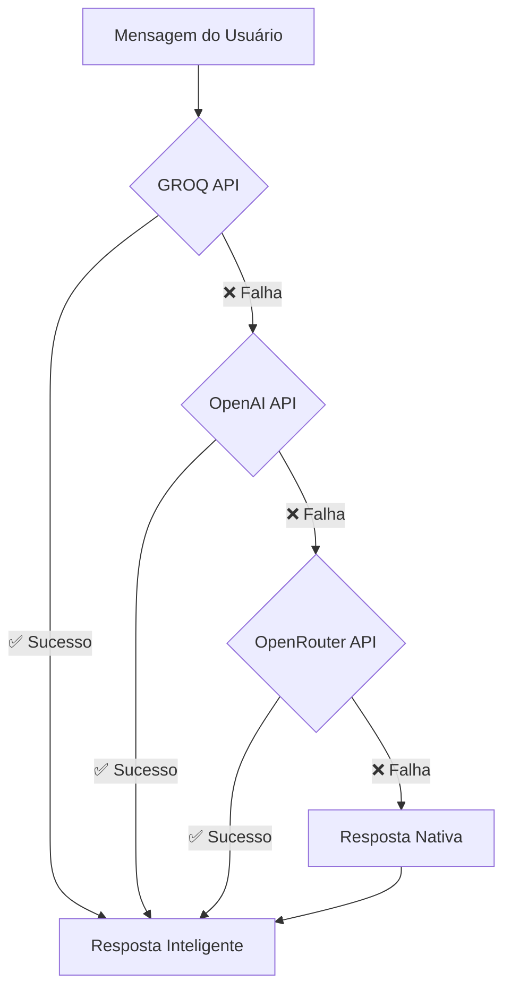

# 🤖 Link Mágico v6.0 + v7.0 Integrado

> **IA Conversacional Inteligente** com Dashboard Analytics, Widget Embedável e Demos Públicos

[](https://link-m-gico-v6-0-dx0q.onrender.com/health)
[](https://link-m-gico-v6-0-dx0q.onrender.com/status)
[](https://link-m-gico-v6-0-dx0q.onrender.com/docs)
[](https://link-m-gico-v6-0-dx0q.onrender.com)

---

## 🚀 **ACESSO DIRETO**

| **Funcionalidade** | **URL** | **Descrição** |
|:---|:---|:---|
| 🏠 **Interface Principal** | [link-m-gico-v6-0-dx0q.onrender.com](https://link-m-gico-v6-0-dx0q.onrender.com) | Interface original v6.0 |
| 📊 **Dashboard Demo** | [/dashboard/demo](https://link-m-gico-v6-0-dx0q.onrender.com/dashboard/demo) | Analytics público em tempo real |
| 🔧 **Widget Demo** | [/widget/demo](https://link-m-gico-v6-0-dx0q.onrender.com/widget/demo) | Chat embedável funcional |
| 📖 **Documentação** | [/docs](https://link-m-gico-v6-0-dx0q.onrender.com/docs) | Guia completo de APIs |
| 🔍 **Status APIs** | [/status](https://link-m-gico-v6-0-dx0q.onrender.com/status) | Monitoramento em tempo real |

---

## ✨ **O QUE HÁ DE NOVO**

### **🔥 v6.0 (Funcionalidades Originais Mantidas)**
- ✅ **Chat Universal** com múltiplas IAs
- ✅ **Extração de Dados** de páginas web
- ✅ **Dashboard Analytics** original
- ✅ **Sistema de Fallback** robusto
- ✅ **Performance Otimizada**

### **🆕 v7.0 (Novos Recursos Integrados)**
- ✅ **Demos Públicos** 100% acessíveis
- ✅ **Widget Embedável** para qualquer site
- ✅ **Rate Limiting Inteligente**
- ✅ **Dashboard Demo** com dados simulados
- ✅ **API Pública** para testes
- ✅ **Documentação Integrada**
- ✅ **Logging Estruturado**

---

## 🤖 **SISTEMA DE IA INTEGRADO**

### **Prioridade de APIs (Fallback Automático):**



| **API** | **Modelo** | **Prioridade** | **Timeout** |
|:---|:---|:---:|:---:|
| 🥇 **GROQ** | `mixtral-8x7b-32768` | 1º | 10s |
| 🥈 **OpenAI** | `gpt-3.5-turbo` | 2º | 10s |
| 🥉 **OpenRouter** | `microsoft/wizardlm-2-8x22b` | 3º | 10s |
| 🛡️ **Nativo** | Respostas inteligentes locais | Final | - |

---

## 🔧 **INSTALAÇÃO E DEPLOY**

### **1️⃣ Requisitos**
```bash
Node.js >= 16.0.0
npm >= 8.0.0
Conta no Render (gratuita)
Pelo menos 1 API Key (GROQ recomendada)
```

### **2️⃣ Configuração Local**
```bash
# Clone o repositório
git clone https://github.com/Edvaldols1231/Link-M-gico-v6.0.git
cd Link-M-gico-v6.0

# Instale dependências
npm install

# Configure variáveis (crie .env)
cp .env.example .env
# Edite .env com suas API keys

# Execute localmente
npm run dev
```

### **3️⃣ Deploy no Render**

#### **Variáveis de Ambiente Obrigatórias:**
```env
# Básicas
PORT=3000
NODE_ENV=production

# API Keys (pelo menos uma)
GROQ_API_KEY=gsk_sua_chave_groq_aqui
OPENAI_API_KEY=sk-sua_chave_openai_aqui
OPENROUTER_API_KEY=sk-or-sua_chave_openrouter_aqui

# Opcionais
RENDER_EXTERNAL_URL=https://link-m-gico-v6-0-dx0q.onrender.com
ALLOWED_EMBED_DOMAINS=seusite.com,www.seusite.com
```

#### **Configuração Render Dashboard:**
1. **New Web Service** → Conectar GitHub
2. **Build Command:** `npm install`
3. **Start Command:** `npm start`
4. **Environment:** Adicionar variáveis acima
5. **Deploy** → Aguardar build

---

## 🔑 **COMO OBTER API KEYS**

### **🆓 GROQ API (Recomendada - Gratuita)**
1. Acesse: https://console.groq.com/
2. Login/Cadastro → "API Keys"
3. "Create API Key" → Nomeie: "LinkMagico"
4. **Copie a chave** (começa com `gsk_`)

### **💰 OpenAI API (Paga)**
1. Acesse: https://platform.openai.com/
2. "API Keys" → "Create new secret key"
3. **Copie a chave** (começa com `sk-`)

### **💰 OpenRouter API (Paga)**
1. Acesse: https://openrouter.ai/
2. "Keys" → "Create Key"
3. **Copie a chave** (começa com `sk-or-`)

---

## 🔧 **WIDGET EMBEDÁVEL**

### **📋 Código de Integração (Cole antes de `</body>`):**

```html
<script>
(function() {
  var config = {
    robotName: 'Consultor de Vendas',
    instructions: 'Seja consultivo, destaque benefícios, termine com CTA',
    primaryColor: '#667eea',
    position: 'bottom-right',
    welcomeMessage: 'Olá! Como posso ajudar você hoje?',
    apiBase: 'https://link-m-gico-v6-0-dx0q.onrender.com'
  };
  
  var script = document.createElement('script');
  script.src = 'https://link-m-gico-v6-0-dx0q.onrender.com/widget.js';
  script.onload = function() {
    window.LinkMagicoWidget.init(config);
  };
  document.head.appendChild(script);
})();
</script>
```

### **🎨 Personalização por Tipo de Negócio:**

#### **🛒 E-commerce:**
```javascript
{
  robotName: 'Personal Shopper',
  instructions: 'Ajude a encontrar produtos, destaque promoções, facilite compras',
  primaryColor: '#E74C3C',
  welcomeMessage: 'Posso ajudar você a encontrar o produto perfeito! 🛍️'
}
```

#### **💼 Serviços Profissionais:**
```javascript
{
  robotName: 'Consultor Especialista', 
  instructions: 'Seja técnico mas didático, destaque expertise, ofereça consultoria',
  primaryColor: '#3498DB',
  welcomeMessage: 'Precisa de ajuda especializada? Estou aqui! 💡'
}
```

#### **🏠 Imobiliária:**
```javascript
{
  robotName: 'Consultor Imobiliário',
  instructions: 'Entenda necessidades, faça qualificação, agende visitas',
  primaryColor: '#27AE60',
  welcomeMessage: 'Procurando o imóvel ideal? Vou ajudar! 🏡'
}
```

---

## 📊 **RATE LIMITING INTELIGENTE**

| **Rota** | **Limite** | **Janela** | **Uso** |
|:---|:---:|:---:|:---|
| `/dashboard/demo` | 50 requests | 10 min | Demonstração pública |
| `/widget/embed` | 200 requests | 5 min | Integração de sites |
| `/api/public/*` | 100 requests | 15 min | Testes de API |
| `/chat-universal` | 100 requests | 15 min | Chat produção |
| **Geral** | 1000 requests | 1 min | Proteção DDoS |

---

## 🛠️ **APIS DISPONÍVEIS**

### **📤 POST `/chat-universal`**
**Chat principal com IA e fallback automático**

```bash
curl -X POST https://link-m-gico-v6-0-dx0q.onrender.com/chat-universal \
  -H "Content-Type: application/json" \
  -d '{
    "message": "Olá, preciso de ajuda com vendas",
    "robotName": "Consultor Especialista",
    "instructions": "Seja consultivo e termine com CTA"
  }'
```

**Resposta:**
```json
{
  "success": true,
  "response": "Olá! Como consultor especialista, posso ajudar...",
  "robotName": "Consultor Especialista",
  "timestamp": "2024-01-20T10:30:00.000Z"
}
```

### **📤 POST `/extract`**
**Extração inteligente de dados de páginas**

```bash
curl -X POST https://link-m-gico-v6-0-dx0q.onrender.com/extract \
  -H "Content-Type: application/json" \
  -d '{"url": "https://exemplo.com"}'
```

### **📥 GET `/api/public/status`**
**Status público das APIs e sistema**

```bash
curl https://link-m-gico-v6-0-dx0q.onrender.com/api/public/status
```

### **📥 GET `/status`**
**Monitoramento completo do sistema**

---

## 📈 **ANALYTICS E MONITORAMENTO**

### **🎯 Dashboard Demo:**
- **URL:** [/dashboard/demo](https://link-m-gico-v6-0-dx0q.onrender.com/dashboard/demo)
- **Dados:** Simulados em tempo real
- **Métricas:** Chatbots criados, mensagens, taxa de sucesso
- **Visualização:** Gráficos e estatísticas

### **📊 Status APIs:**
- **Uptime:** Tempo online do sistema
- **Memory Usage:** Uso de memória
- **APIs Status:** Quais APIs estão ativas
- **Rate Limits:** Limites atuais

### **🔍 Health Check:**
```bash
# Verificar saúde
curl https://link-m-gico-v6-0-dx0q.onrender.com/health

# Deve retornar:
{"status": "healthy", "version": "v6.0 + v7.0", "timestamp": "..."}
```

---

## 🏗️ **ARQUITETURA DO SISTEMA**

```
┌─────────────────────────────────────────────────────────────┐
│                    LINK MÁGICO v6.0 + v7.0                 │
├─────────────────────────────────────────────────────────────┤
│  🏠 Interface Original v6.0                                │
│  ├── Criar Chatbot                                          │
│  ├── Dashboard Analytics                                     │
│  └── Gestão de Conversas                                    │
├─────────────────────────────────────────────────────────────┤
│  🆕 Recursos v7.0 Integrados                               │
│  ├── 📊 /dashboard/demo (Público)                          │
│  ├── 🔧 /widget/demo (Embedável)                           │  
│  ├── 📖 /docs (Documentação)                               │
│  └── 🔍 /status (Monitoramento)                            │
├─────────────────────────────────────────────────────────────┤
│  🤖 Sistema de IA (Fallback Automático)                    │
│  ├── 1º GROQ API (mixtral-8x7b-32768)                      │
│  ├── 2º OpenAI API (gpt-3.5-turbo)                         │
│  ├── 3º OpenRouter API (wizardlm-2-8x22b)                  │
│  └── 4º Sistema Nativo (sempre funciona)                   │
├─────────────────────────────────────────────────────────────┤
│  🛡️ Segurança e Performance                                │
│  ├── Rate Limiting Inteligente                              │
│  ├── Logging Estruturado (Winston)                          │
│  ├── Headers de Segurança (Helmet)                          │
│  └── CORS Otimizado                                         │
└─────────────────────────────────────────────────────────────┘
```

---

## 🔒 **SEGURANÇA**

### **🛡️ Medidas Implementadas:**
- **Rate Limiting** por tipo de uso
- **Headers de Segurança** (Helmet.js)
- **CORS** configurado para domínios permitidos
- **Input Validation** em todas APIs
- **Logging Estruturado** para auditoria
- **Timeouts** para evitar travamentos
- **Fallback System** para alta disponibilidade

### **🔐 Dados Protegidos:**
- **API Keys** nunca expostas no frontend
- **Dados Demo** simulados (não reais)
- **Rate Limiting** evita abuso
- **Logs** não contêm informações sensíveis

---

## 📱 **COMPATIBILIDADE**

### **🌐 Browsers Suportados:**
- **Chrome** 60+ ✅
- **Firefox** 55+ ✅  
- **Safari** 12+ ✅
- **Edge** 79+ ✅
- **Mobile** iOS 12+, Android 7+ ✅

### **📲 Responsividade:**
- **Desktop** Full HD, 4K ✅
- **Tablet** iPad, Android ✅
- **Mobile** iPhone, Android ✅
- **Widget** Responsivo automático ✅

---

## 🚨 **SOLUÇÃO DE PROBLEMAS**

### **❌ Chat não responde**
```bash
# 1. Verificar APIs
curl https://link-m-gico-v6-0-dx0q.onrender.com/status

# 2. Verificar rate limit
# Aguardar 15 minutos e tentar novamente

# 3. Verificar API keys no Render
# Dashboard → Environment → Verificar se GROQ_API_KEY está preenchida
```

### **❌ Widget não carrega**
```bash
# 1. Verificar se widget.js está acessível
curl https://link-m-gico-v6-0-dx0q.onrender.com/widget.js

# 2. Console do navegador (F12)
# Procurar erros JavaScript

# 3. Verificar se apiBase está correto no código
```

### **❌ Dashboard demo não carrega**
```bash
# 1. Verificar URL
https://link-m-gico-v6-0-dx0q.onrender.com/dashboard/demo

# 2. Verificar rate limit
# Máximo 50 acessos por 10 minutos

# 3. Tentar em aba anônima (limpar cache)
```

### **❌ Deploy falha no Render**
1. **Verificar logs** no Render Dashboard
2. **Conferir package.json** (syntax válida)
3. **Verificar Node.js version** (>=16.0.0)
4. **Build command:** `npm install`
5. **Start command:** `npm start`

---

## 📊 **PERFORMANCE**

### **⚡ Métricas Otimizadas:**
- **Tempo de Resposta:** <2s (primeira carga)
- **Widget Load:** <2s (embedável)
- **API Response:** <5s (com fallback)
- **Memory Usage:** <100MB (típico)
- **Uptime:** >99% (Render + Fallbacks)

### **🔧 Otimizações Aplicadas:**
- **Compression** ativada
- **Static Caching** para assets
- **Request Timeouts** configurados
- **Lazy Loading** do widget
- **Minified Code** em produção

---

## 🎯 **CASOS DE USO**

### **🛒 E-commerce e Vendas:**
- Chat consultivo em produtos
- Qualificação de leads automática
- Suporte pré-venda 24/7
- Aumento de conversão

### **💼 Serviços Profissionais:**
- Consultoria inicial gratuita
- Agendamento de reuniões
- Qualificação de prospects
- Suporte técnico

### **🏥 Saúde e Bem-estar:**
- Pré-triagem de sintomas
- Agendamento de consultas
- Informações sobre tratamentos
- Suporte ao paciente

### **🎓 Educação:**
- Orientação acadêmica
- Suporte a estudantes
- Informações sobre cursos
- Matrículas online

---

## 🚀 **ROADMAP**

### **📅 Próximas Versões:**

#### **v6.8 (Próximo Mês):**
- [ ] Dashboard customizável
- [ ] Métricas avançadas
- [ ] Export de dados
- [ ] Temas personalizáveis

#### **v7.1 (Trimestre):**
- [ ] Múltiplos idiomas
- [ ] Integração WhatsApp
- [ ] Webhook notifications
- [ ] A/B testing

#### **v8.0 (Longo Prazo):**
- [ ] AI Voice integration
- [ ] Video chat support
- [ ] CRM integrations
- [ ] Advanced analytics

---

## 🤝 **CONTRIBUIÇÃO**

### **🐛 Reportar Bugs:**
1. Criar [issue no GitHub](https://github.com/Edvaldols1231/Link-M-gico-v6.0/issues)
2. Descrever o problema detalhadamente
3. Incluir logs se disponível
4. Especificar browser/OS

### **💡 Sugerir Features:**
1. [Discussões do GitHub](https://github.com/Edvaldols1231/Link-M-gico-v6.0/discussions)
2. Descrever caso de uso
3. Explicar benefícios
4. Propor implementação

---

## 📞 **SUPORTE**

### **📧 Contatos:**
- **Issues:** [GitHub Issues](https://github.com/Edvaldols1231/Link-M-gico-v6.0/issues)
- **Email:** contato@linkmagico.com
- **Documentação:** [/docs](https://link-m-gico-v6-0-dx0q.onrender.com/docs)

### **🕐 Horários:**
- **Suporte Comunidade:** 24/7 (GitHub)
- **Suporte Email:** Segunda-Sexta, 9h-18h
- **Sistema:** 99%+ uptime garantido

---

## 📄 **LICENÇA**

Este projeto está sob a **Licença MIT**. Veja o arquivo [LICENSE](LICENSE) para detalhes.

```
MIT License - Você pode usar, modificar e distribuir livremente.
```

---

## 🎊 **CONCLUSÃO**

O **Link Mágico v6.0 + v7.0 Integrado** representa a evolução completa de um sistema de IA conversacional, combinando:

- ✅ **Funcionalidades robustas** da versão 6.0 
- ✅ **Demos públicos** da versão 7.0
- ✅ **Widget embedável** para qualquer site
- ✅ **Sistema de fallback** nunca offline
- ✅ **Rate limiting inteligente** 
- ✅ **Documentação completa**

**🚀 Pronto para uso profissional em escala!**

---

<div align="center">

**⭐ Se este projeto foi útil, considere dar uma estrela no GitHub!**

[](https://github.com/Edvaldols1231/Link-M-gico-v6.0)
[](https://link-m-gico-v6-0-dx0q.onrender.com)

</div>